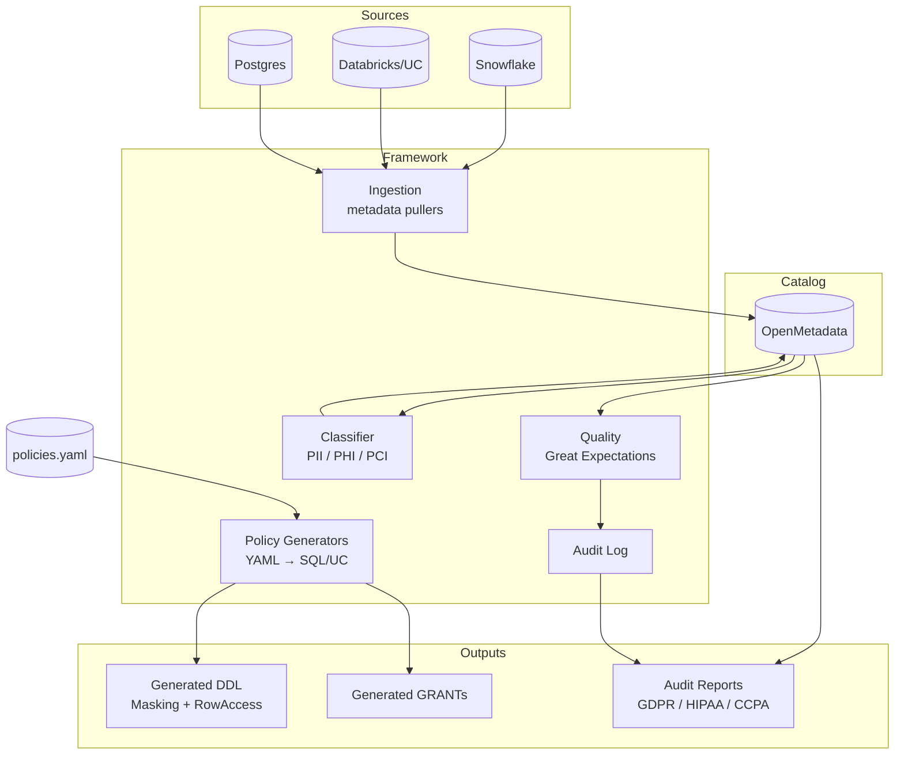

# Architecture

## System overview

## Design principles

### Policy-as-code

Access decisions, masking rules, retention, and ownership all live in one YAML file under git. Changes go through PR review. The catalog and warehouse are *projections* of this source of truth, not authoritative records.

### Generators over runtime evaluation

A runtime policy engine would create a hot dependency on the framework. Instead, the generators produce **plain Snowflake DDL and Unity Catalog GRANTs** that the warehouses enforce natively. If the framework disappears tomorrow, the controls keep working.

### Pluggable catalog

`ingestion/` and the catalog API client are the only components that bind to OpenMetadata. Swapping in DataHub or Collibra is a matter of replacing one client.

### Default deny

The generator emits an explicit `REVOKE SELECT FROM PUBLIC` for every table in scope before issuing role-scoped GRANTs. Anything not listed in `policies.yaml` ends the day with no access.

## What lives where

| Concern | Module | Authority |
|---|---|---|
| What datasets exist | `ingestion/` | The source platforms (read-only) |
| Who owns / sensitivity / access | `policies.yaml` | Humans, via git |
| What's PII | `classification/` | Patterns + sampling, reviewable rules |
| Is the data valid | `quality/suites/` | Great Expectations |
| Compliance evidence | `compliance/` | Generated from the above |

## Trade-offs

- **OpenMetadata** chosen for open standards + column-level lineage; DataHub is a stronger choice if your team prefers a Python-first ecosystem
- **YAML over a UI** for policies — slower to author, but version-controlled and reviewable
- **Generators over a runtime engine** — less flexible, but the controls are independent of framework uptime
