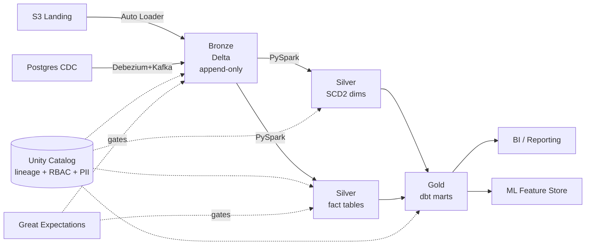

# Architecture

## Overview

A medallion lakehouse with three logical layers — Bronze (raw), Silver (cleansed and conformed), Gold (business marts) — built on Delta Lake and orchestrated by Airflow.

## Layer contracts

| Layer | Mutability | Schema | Latency target | Owners |
|---|---|---|---|---|
| Bronze | Append-only | Schema-on-read | Continuous (~1 min) | Data Engineering |
| Silver | MERGE / Type-2 | Strongly typed, conformed | < 30 min after Bronze | Data Engineering |
| Gold | Rebuild / incremental | Dimensional (star) | Hourly | Analytics Engineering |

## Why Delta over Parquet

- ACID semantics for concurrent writers
- MERGE INTO for SCD2 and idempotent upserts
- Time travel for replay and audit
- Z-ORDER for high-cardinality predicate pushdown
- Built-in column statistics

## Why dbt for Gold but PySpark for Silver

PySpark earns its keep where logic is procedural — SCD2 merges, schema reconciliation, complex window functions, and explode operations on nested order lines. dbt earns its keep where logic is declarative SQL with strong testing, documentation, and lineage needs — which is exactly what Gold marts are. The split aligns ownership: engineers own Silver, analytics engineers own Gold.

## Governance model

- Each layer is a separate Unity Catalog schema with distinct grants
- PII columns tagged at Silver, masking enforced via dynamic views in Gold
- Lineage produced automatically by Unity Catalog from query plans
- Column-level access control via row-filter and column-mask policies

## Data quality

Quality gates run as Airflow tasks between layers. A failed Great Expectations checkpoint blocks the downstream task, preventing bad data from reaching Gold. Suites are versioned alongside code and reviewed in PRs.
