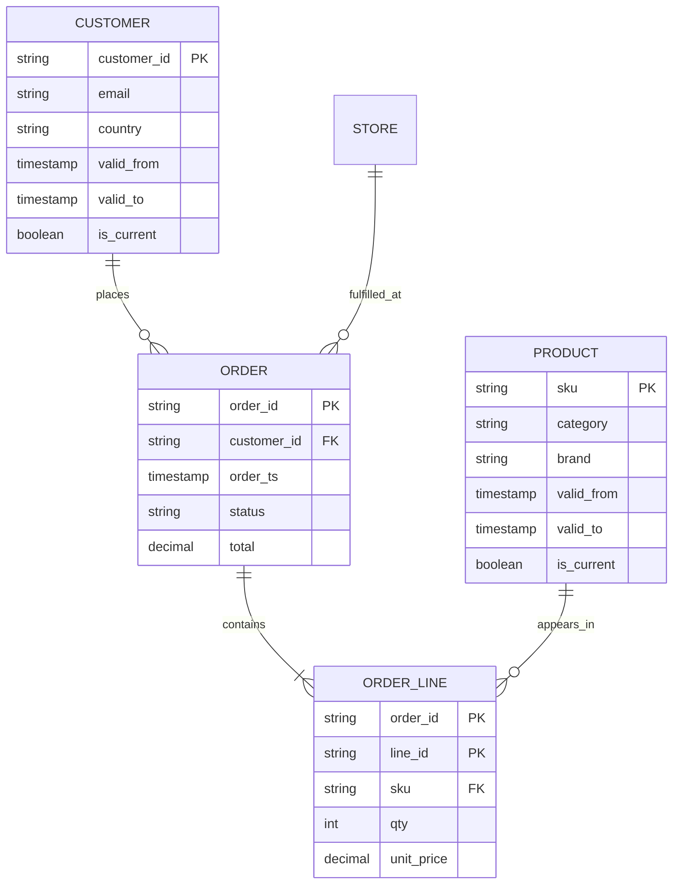
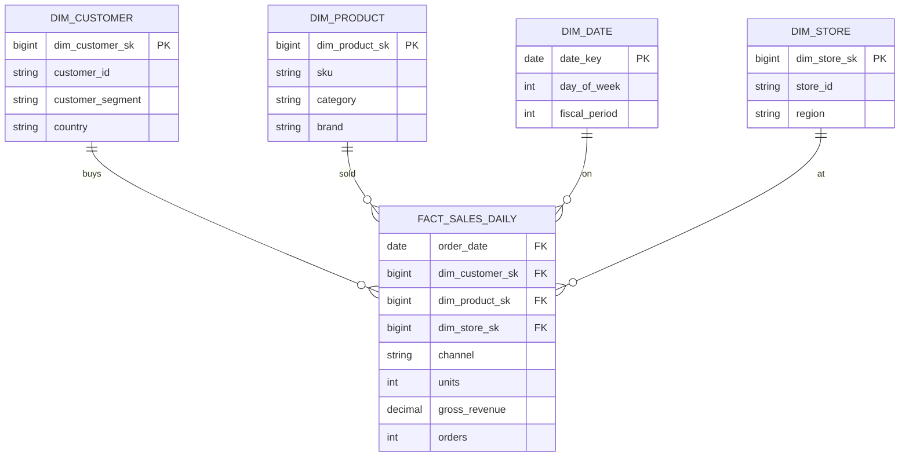

# Data Model

## Silver — 3NF, conformed

## Gold — star schema

## SCD Type 2 columns

All dimensions carry these audit columns:

| Column | Purpose |
|---|---|
| `dim_xxx_sk` | Surrogate key, monotonically increasing |
| `valid_from` | Timestamp when this version became active |
| `valid_to` | Timestamp when this version was superseded (NULL if current) |
| `is_current` | Boolean flag for fast filtering of latest version |
| `_attr_hash` | SHA-256 over tracked attributes, used for change detection |
