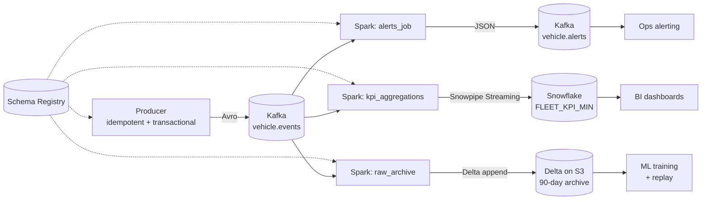

# Architecture

## Hot / Warm / Cold split

## Why three sinks?

| Path | Latency target | Use case | Why this technology |
|---|---|---|---|
| Hot — Kafka | < 2s p99 | Operational alerts | Sub-second propagation; consumers already on Kafka |
| Warm — Snowflake | ~10s | BI / executive dashboards | Cheap analytics, easy joins to dims, Snowpipe Streaming |
| Cold — Delta on S3 | 60s | ML training + incident replay | Cheapest storage; replayable; columnar reads |

## Why Spark Structured Streaming?

- **Same engine for batch and streaming** — code reuse with the lakehouse project
- **Exactly-once via checkpointing** when paired with idempotent sinks
- **RocksDB state backend** for bounded state on stateful aggregations
- **Native Kafka + Delta + Snowflake connectors**

Flink would be a stronger choice for sub-100ms latency or millions-of-keys aggregations; for this workload, Spark's throughput-per-dollar wins.

## Why Avro + Schema Registry?

- Compact wire format (~30% smaller than JSON for this payload)
- Schema-evolution rules enforced server-side
- Schemas versioned and reviewable in PRs
- Compatible with downstream tools (kSQL, Snowflake Kafka connector, Flink)

## Scaling characteristics

- **Linear**: throughput scales with partition count up to ~250 partitions
- **State**: bounded by `(distinct keys × state TTL)`; current config uses ~2 GB RocksDB per executor at 50K eps
- **Bottleneck**: at sustained 100K+ eps, the bottleneck becomes Snowpipe Streaming channel count, not Spark

## Runbook quick links

- [Delivery guarantees](delivery-guarantees.md)
- [Operational runbook](runbook.md)
